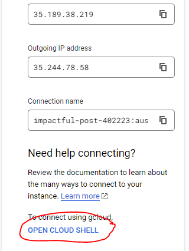
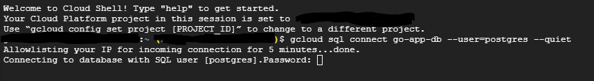
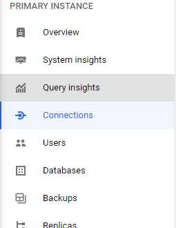
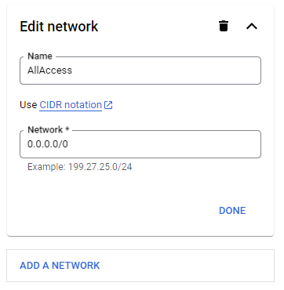

To start Postgres instance go to terraform/createVM folder and run:

```
terraform apply -target=google_sql_database_instance.postgres_goApp
```

Once the instance is fully running go to:

    GCP Console -> SQL -> go-app-db -> Users (on the sidebar) -> 
    Change Password for postgres user

Go back to Overview, select 'Open Cloud Shell'




Once Connected, enter the password you assigned to the user



Now to create the database type:

    CREATE DATABASE users

Check that database is created by typing:

    \l

And use arrow keys to scroll down.

Go to Connections:



GO to Networking, scroll down and ADD A NETWORK with the following settings (or the ip address of the backend):



Now you can deploy the rest using:

    terraform apply